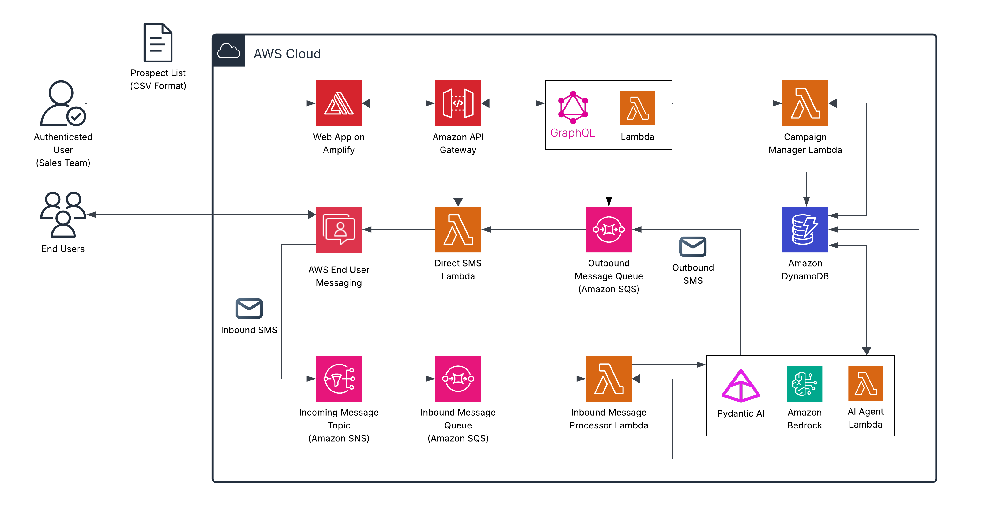

# Smart Outreach Hub

| Index                                   | Description                                                      |
|:----------------------------------------|:-----------------------------------------------------------------|
| [Overview](#overview)                   | See the motivation behind this project                           |
| [Description](#description)             | Learn more about the problem, and how we approached the solution |
| [Deployment](#deployment)               | How to install and deploy the solution                           |
| [Usage](#usage)                         | How to use Smart Outreach Hub                                    |
| [Troubleshooting](#troubleshooting)     | Common issues and solutions                                      |
| [Lessons Learned](#lessons-learned)     | Key takeaways and insights from the project, and next steps      |
| [Bill of Materials](#bill-of-materials) | Cost of deployment and resources used                            |
| [Credits](#credits)                     | Meet the team behind this project                                |
| [License](#license)                     | See the project's license information                            |
| [Disclaimers](#Disclaimers)             | Disclaimers information.                                         

# Overview

Smart Outreach Hub is an **intelligent AI-driven SMS marketing platform** designed to transform customer engagement through personalized, automated messaging. The solution leverages modern large language models (LLMs) to drive meaningful conversations, engage with prospects, and guide them toward purchase decisions and/or philanthropic contributions.

This project was initiated in response to a real-world challenge faced by the University of Pittsburgh's Athletics department, which sought to enhance its outreach efforts to potential ticket buyers, alumni, and donors. By harnessing the power of AI, Smart Outreach Hub aims to streamline communication processes, improve response rates, and ultimately boost revenue generation through targeted SMS campaigns.

The platform delivers a comprehensive suite of features, including campaign management, real-time customer response handling, AI-powered automated replies, intelligent routing to human agents, and campaign analytics.

**_While built for Pitt Athletics, the solution is designed to be adaptable for any organization requiring automated SMS outreach with human oversight. The AI agent's behavior can be customized through prompt engineering to match different use cases, industries, and communication styles._**

## Demo
https://github.com/user-attachments/assets/f522c984-0acd-493c-8e29-4c19f7560396

# Description

## Problem Statement
Pitt Athletics faced a significant challenge in scaling their fan engagement efforts due to limited capacity of their sales team. Despite having a large database of potential leads including fans and alumni interested in purchasing tickets or making philanthropic contributions, the department lacks the automated outreach capabilities needed to effectively engage this audience at scale. The existing systems provide robust data management but cannot facilitate the automated, personalized initial contact and qualification processes necessary to reach thousands of potential supporters. This resource constraint leaves many potential leads unengaged, creating a significant gap in their outreach strategy and revenue opportunities. An automated AI-driven solution would bridge this gap, enabling the department to efficiently connect with a broader audience while still maintaining meaningful, personalized interactions.

## Our Approach

Smart Outreach Hub addresses these challenges through an intelligent, scalable SMS engagement platform that combines AI-driven conversation management with human oversight. The solution automates initial outreach and qualification while maintaining the personalized touch that makes customer interactions meaningful.

**Agentic AI Workflow**: At the core of the system is an agentic AI workflow powered by Claude Sonnet 4 via Amazon Bedrock, integrated using Pydantic AI. When customers respond to campaigns, messages are validated, stored in Amazon DynamoDB, and processed through the AI agent which maintains conversation history to provide contextually relevant responses. The agent follows carefully designed prompts that embody the personality of a sales representative. Built-in guardrails ensure appropriate interactions, and the system intelligently determines when conversations should be escalated to human sales representatives based on purchase intent, information needs, or explicit customer requests.

**Serverless Event-Driven Architecture**: The platform leverages a fully serverless, event-driven architecture built on AWS services including Lambda, SQS, SNS, DynamoDB, and AWS End User Messaging. Outbound campaigns are queued via SQS and processed through dedicated Lambda functions that handle SMS delivery, while inbound messages flow through SNS topics to SQS queues that trigger the agentic AI workflow. This architecture provides automatic scaling to handle thousands of concurrent conversations, eliminates server management overhead, and ensures cost-efficient operation by charging only for actual usage. The decoupled nature of the event-driven design allows each component to scale independently based on demand.

**Modern User Interface**: The web interface provides sales teams with comprehensive campaign management capabilities including prospect list uploads via CSV, campaign creation and editing, and real-time delivery of campaign messages. Beyond campaign operations, the interface offers visibility into key metrics such as handoff rates and response sentiment analysis. When human intervention is needed, the chat interface displays complete conversation histories including AI-generated responses, enabling seamless takeover and continuity in customer interactions.


## Architecture Diagram




## Tech Stack

| Category                      | Technology                                                              | Purpose                                                                                         |
|:------------------------------|:------------------------------------------------------------------------|:------------------------------------------------------------------------------------------------|
| **Amazon Web Services (AWS)** | [AWS CDK](https://docs.aws.amazon.com/cdk/)                             | Infrastructure as code for deployment and resource provisioning                                 |
|                               | [Amazon Bedrock](https://aws.amazon.com/bedrock/)                       | Provides access to Claude Sonnet 4 for AI-powered conversations                                 |
|                               | [AWS Lambda](https://aws.amazon.com/lambda/)                            | Serverless compute for handling campaign processing, message processing, and API endpoints      |
|                               | [Amazon DynamoDB](https://aws.amazon.com/dynamodb/)                     | NoSQL database for storing campaigns, customers, messages, and conversation history             |
|                               | [AWS End User Messaging](https://aws.amazon.com/end-user-messaging/)    | Manages origination phone numbers and SMS sending/receiving                                     |
|                               | [Amazon Simple Queue Service (SQS)](https://aws.amazon.com/sqs/)        | Message queuing for campaign distribution and inbound message processing                        |
|                               | [Amazon Simple Notification Service (SNS)](https://aws.amazon.com/sns/) | Routes incoming SMS messages to processing queues                                               |
|                               | [Amazon API Gateway](https://aws.amazon.com/api-gateway/)               | HTTP API endpoint for GraphQL backend                                                           |
|                               | [Amazon Cognito](https://aws.amazon.com/cognito/)                       | User authentication and authorization for sales team members                                    |
|                               | [AWS Amplify](https://aws.amazon.com/amplify/)                          | Hosts and deploys the React frontend application                                                |
| **Backend**                   | [Pydantic AI](https://ai.pydantic.dev/)                                 | Framework for building the AI agent with structured outputs and Amazon Bedrock integration      |
|                               | [GraphQL](https://graphql.org/)                                         | Custom API server running on Lambda for frontend data operations                                |
| **Frontend**                  | [React](https://react.dev/)                                             | UI framework for building the web interface                                                     |
|                               | [React Router](https://reactrouter.com/)                                | Client-side routing for navigation between campaigns, customer responses, and message histories |
|                               | [Tailwind CSS](https://tailwindcss.com/)                                | Utility-first CSS framework for styling components                                              |

# Deployment

## Prerequisites

Before deploying the Smart Outreach Hub solution, ensure you have the following prerequisites in place:
1. Sign up for an [AWS account](https://signin.aws.amazon.com/signup?request_type=register) if you haven't already
2. **Node.js** (v18 or later) - [Download here](https://nodejs.org/en/download) or use a node version manager like [nvm](https://github.com/nvm-sh/nvm)
3. **AWS CDK** (v2) - Install via `npm`:
   ```bash
   npm install -g aws-cdk
   ```
4. **AWS CLI** - [Installation Guide](https://docs.aws.amazon.com/cli/latest/userguide/getting-started-install.html)
5. **Docker** - [Download here](https://www.docker.com/get-started/)
6. **Git** - [Download here](https://git-scm.com/)

## AWS Configuration

1. **[Request a phone number in AWS End User Messaging](https://docs.aws.amazon.com/sms-voice/latest/userguide/phone-numbers-request.html) before deploying the solution. This step is crucial as the phone number is required for the SMS functionalities of the platform.**

2. **Configure AWS CLI with your credentials**:
   ```bash
   aws configure
   ```
   Provide your AWS Access Key ID, Secret Access Key, AWS region (e.g., `us-east-1`) and `json` as the output format when prompted.
3. **Bootstrap your AWS environment for CDK (_required only once per AWS account/region_)**:
   ```bash
   cdk bootstrap aws://ACCOUNT_ID/REGION
   ```
   Replace `ACCOUNT_ID` and `REGION` with your AWS account ID and your region (e.g., `us-east-1`).

## Backend Deployment

1. **Clone the repository and navigate to the project directory**:
   ```bash
   git clone https://github.com/pitt-cic/smart-outreach-hub.git
   cd smart-outreach-hub
   ```
2. **Copy the example context file i.e., [`backend/cdk.context.example.json`](./backend/cdk.context.example.json) and update with your configuration**:
   ```bash
   cp backend/cdk.context.example.json backend/cdk.context.json
   ```
   Edit [`backend/cdk.context.json`](./backend/cdk.context.json) to include your **origination number**, **phone number ID**, **Bedrock model name** (we recommend `us.anthropic.claude-sonnet-4-20250514-v1:0`), **Pydantic Logfire token**, and **Calendly URL**.

<details open>
  <summary><strong>Method 1: Use deployment script (recommended)</strong></summary>

  *If you're in a Windows environment, install [WSL](https://learn.microsoft.com/en-us/windows/wsl/install) first to run the deployment script.*

  **Run the [`deploy_backend.sh`](./deploy_backend.sh) script from the root of the repository to deploy the backend**:
  ```bash
  # Set executable permissions and run the script
  chmod +x ./deploy_backend.sh
  sh ./deploy_backend.sh
  ```

  The deployment script will:
  - Check for all required prerequisites
  - Validate required fields in [`backend/cdk.context.json`](./backend/cdk.context.json)
  - Install backend dependencies
  - Bootstrap CDK if not already done
  - Deploy the backend CDK stack and provide stack outputs upon completion
</details>

<details>
  <summary><strong>Method 2: Manual steps</strong></summary>

  1. **Navigate to the backend directory**:
     ```bash
     cd backend
     ```
  2. **Install the dependencies**:
     ```bash
     npm install
     ```
  3. **Deploy the backend using CDK**:
     ```bash
     npx cdk deploy
     ```
</details>

## Frontend Deployment

**_Please ensure your backend is fully deployed before proceeding with the frontend deployment._**

<details open>
  <summary><strong>Method 1: Use deployment script (recommended)</strong></summary>

  *If you're in a Windows environment, install [WSL](https://learn.microsoft.com/en-us/windows/wsl/install) first to run the deployment script.*

  **Run the [`deploy_frontend.sh`](./deploy_frontend.sh) script from the root of the repository to deploy the frontend**:
  ```bash
  # Set executable permissions and run the script
  chmod +x ./deploy_frontend.sh
  sh ./deploy_frontend.sh
  ```

  The deployment script will:
  - Automatically pull CDK outputs from the backend deployment
  - Install frontend dependencies, create the required environment variables, and build the React app
  - Upload the build to AWS Amplify and deploy
  - Monitor deployment status until completion
</details>

<details>
  <summary><strong>Method 2: Manual steps</strong></summary>

  1. **Navigate to the frontend directory**:
     ```bash
     cd frontend
     ```
  2. **Get the stack outputs from the backend deployment**:
     ```bash
     export STACK_NAME="SmartOutreachHubBackendStack"
     aws cloudformation describe-stacks --stack-name $STACK_NAME --query "Stacks[0].Outputs[].{OutputKey:OutputKey,OutputValue:OutputValue}" --output table
     ```
  3. **Note down the following output values**:
     - `AmplifyAppId`
     - `ApiGatewayUrl`
     - `GraphQLApiUrl`
     - `CognitoUserPoolId`
     - `CognitoUserPoolClientId`
     - `CognitoDomain`
     - `AmplifyDomainURL`
  4. **Create a `.env.production` file in the `frontend` directory with the following content**:
     
     **`.env.production`**
     ```bash
     VITE_API_URL=$AmplifyAppId
     VITE_GRAPHQL_API_URL=$ApiGatewayUrl
     VITE_COGNITO_USER_POOL_ID=$CognitoUserPoolId
     VITE_COGNITO_USER_POOL_CLIENT_ID=$CognitoUserPoolClientId
     VITE_COGNITO_DOMAIN=$CognitoDomain
     VITE_NODE_ENV=production
     ```
  5. **Install the dependencies**:
     ```bash
     npm install
     ```
  6. **Build the React app**:
     ```bash
     npm run build
     ```
  7. **Create a redirects file for SPA support**:
     ```bash
     cat > dist/_redirects << 'EOF'
     /* /index.html 200
     EOF
     ```
  8. **Zip the build directory**:
     ```bash
     cd dist
     zip -r ../frontend.zip . -x "*.DS_Store"
     ```
  9. **Create an Amplify deployment**:
      ```bash
      aws amplify create-deployment --app-id $AmplifyAppId --branch-name main
      ```
      Note down the `jobId` and `zipUploadUrl` from the output.
  10. **Upload the zip file to the provided `zipUploadUrl`**:
      ```bash
      curl -X PUT -T ../frontend.zip $zipUploadUrl
      ```
  11. **Start the deployment**:
      ```bash
      aws amplify start-deployment --app-id $AmplifyAppId --branch-name main --job-id $jobId
      ```
  12. **Monitor the deployment status**:
      ```bash
      aws amplify get-job --app-id $AmplifyAppId --branch-name main --job-id $jobId
      ```
</details>

---

# Usage
1. **Accessing the application**:
   
   Once both backend and frontend are deployed, access the Smart Outreach Hub web interface using the `AmplifyDomainURL` from the backend stack outputs.
   ```plaintext
   https://main.<amplify-app-id>.amplifyapp.com
   ```

2. **User Registration**:
   
   Register a new user account in Amazon Cognito User Pool. You can use the AWS Management Console to do this. [Learn more about creating new user accounts in Cognito](https://docs.aws.amazon.com/cognito/latest/developerguide/how-to-create-user-accounts.html).

3. **Login**:
   
   Log in to the application using the credentials of the user account you just created.

4. **Creating a Campaign**:

   - Navigate to the **Campaigns** tab and click on **Create Campaign**.
   - Fill in the campaign details including name, message template, campaign description, and add any dynamic fields (e.g., `first_name`, `last_name`) you'd like to substitute in the message.
   - Once the campaign is created, you can upload a CSV file containing the list of prospects. A sample CSV template can be downloaded from the interface.
   - On successful upload, click the **Send Campaign** button to start sending messages to the prospects.

5. **How are user responses handled?**

   - When a prospect responds to the SMS, their message is processed by the agentic AI workflow.
   - The AI agent analyzes the message, maintains conversation context, and generates an appropriate response based on the predefined prompts and guardrails.
   - If the AI determines that the conversation requires human intervention (e.g., high purchase intent, complex queries), it flags the conversation for handoff to a sales representative.
   - After a human handoff occurs, the sales team can continue the conversation using the chat interface provided in the **Customer Responses** tab.

6. **Using the Customer Responses Interface**:
   
   - Navigate to the **Customer Responses** tab to view all conversations with the prospects.
   - The conversations are filtered into three categories:
     - **All**: View all conversations.
     - **Needs Response**: Conversations that require human intervention.
     - **Agent Responding**: Conversations currently being handled by a human agent.
     - **Automated**: Conversations being managed by the AI agent.
   - Use the search and filter options to find specific customers or conversations.
   - Click on a conversation to view the full message history, including AI-generated responses.
   - If a conversation is flagged for human intervention, you can take over by sending a message directly from the chat interface.
   - To move conversations back to AI handling, update the status to **Automated**.

7. **Autofill Meeting Link Feature**:

   - The chat interface includes an **Fill Meeting Link** button, which automatically inserts a Calendly scheduling link into the message input field.
   - This feature is designed to streamline the process of scheduling meetings with prospects, allowing sales representatives to quickly share their availability without leaving the chat interface.

# Troubleshooting

1. **CDK Bootstrap Issues**:
   
   - If you encounter errors during the `cdk bootstrap` step, ensure that your AWS CLI is configured correctly with the necessary permissions.
   - You may need to run `aws configure` again to verify your credentials.
   - Explicitly set the AWS Account ID and Region in the bootstrap command:
     ```bash
     cdk bootstrap aws://ACCOUNT_ID/REGION
     ```

2. **Deployment Script Errors**:

   - If you get a "Permission denied" error when running the deployment scripts, ensure that you have set the executable permissions:
     ```bash
     chmod +x ./deploy_backend.sh
     chmod +x ./deploy_frontend.sh
     ```
   - Make sure you are running the scripts in a compatible environment (e.g., WSL for Windows users).
   - Check that all [prerequisites](#prerequisites) are installed and properly configured.
   - Review the [`backend/cdk.context.json`](backend/cdk.context.json) file to ensure all required fields are filled out correctly.
   - Ensure your AWS CLI credentials have the necessary permissions to create and manage AWS resources.
   - Run the scripts from the root of the repository to ensure relative paths are correct.

3. **End users not receiving SMS messages**:

   - Ensure that your AWS End User Messaging account is out of the sandbox mode. In sandbox mode, you can only send messages to [verified destination phone numbers](https://docs.aws.amazon.com/sns/latest/dg/sns-sms-sandbox-verifying-phone-numbers.html).
   - Learn how to move Amazon SNS SMS out of the sandbox mode [here](https://docs.aws.amazon.com/sns/latest/dg/sns-sms-sandbox-moving-to-production.html).
   - Verify that the origination number and phone number ID in the [`backend/cdk.context.json`](backend/cdk.context.json) file are correct and correspond to the number you requested in AWS End User Messaging.
   - Verify that the phone number you requested in AWS End User Messaging is active and capable of two-way messaging.
   - Check your AWS SNS and SQS configurations to ensure messages are being sent and received correctly.
   - Review the CloudWatch logs for the Lambda functions to identify any errors during message processing.

# Lessons Learned

> To be updated

# Bill of Materials

## Pricing Structure

### One-Time Setup Costs
| Service                          | Description                                | Cost    |
|----------------------------------|--------------------------------------------|---------|
| **AWS End User Messaging Setup** | Phone number acquisition and configuration | $118.00 |

### AWS Service Pricing
| Service                              | Pricing Model                                         | Cost                            |
|--------------------------------------|-------------------------------------------------------|---------------------------------|
| **AWS Lambda**                       | \$0.20/1M requests + \$0.0000166667/GB-second         | Serverless compute              |
| **Amazon API Gateway**               | \$3.50/1M requests                                    | First 333M REST API requests    |
| **Amazon Cognito**                   | Free up to 10,000 MAUs, then \$0.015/MAU              | User authentication             |
| **AWS Amplify**                      | \$0.01/build minute + \$0.15/GB storage               | Frontend hosting                |
| **Amazon CloudWatch**                | \$0.50/GB ingested + \$0.03/GB stored                 | Logging & monitoring            |
| **Amazon DynamoDB**                  | \$0.125/1M read requests + \$0.625/1M write requests  | NoSQL database operations       |
| **AWS End User Messaging (SMS)**     | \$0.00883/outbound message & \$0.0075/inbound message | SMS Exchange operations         |
| **Amazon Bedrock (Claude Sonnet 4)** | \$3.00/1M input tokens & \$15.00/1M output tokens     | AI processing for conversations |

## Example Campaign: 30,000 Messages

Based on a monthly campaign of 30,000 SMS messages with a 5% response rate (1,500 conversations) and an average of 5 message exchanges per conversation.

### Cost Breakdown
| Component              | Calculation                                  | Monthly Cost |
|------------------------|----------------------------------------------|--------------|
| **Outbound Messaging** | 30,000 × \$0.00883                           | \$264.90     |
| **Inbound Messaging**  | 1,500 × \$0.0075                             | \$11.25      |
| **AI Processing**      | 1,500 conversations × \$0.0435/conversation* | \$65.25      |
| **AWS Services**       | Monthly AWS Service costs                    | $8.53        |
| **Total**              |                                              | **$349.93**  |

*AI cost per conversation breakdown:*
- Input tokens: ~10,500 tokens × \$3.00/1M = \$0.0315
- Output tokens: ~800 tokens × \$15.00/1M = \$0.012
- Total per conversation: ~\$0.0435

### AWS Services Monthly Costs
| Service                     | Monthly Cost | Usage                | Notes                   |
|-----------------------------|--------------|----------------------|-------------------------|
| **AWS Lambda**              | ~\$2.00      | Function executions  | Based on actual metrics |
| **Amazon API Gateway**      | ~\$3.00      | API requests         |                         |
| **Amazon Cognito**          | ~\$2.00      | User authentication  |                         |
| **AWS Amplify**             | ~\$1.00      | Frontend hosting     |                         |
| **Amazon CloudWatch**       | ~\$0.50      | Logging & monitoring |                         |
| **Amazon DynamoDB**         | ~$0.03       | Database operations  | Based on actual usage   |
| **Total AWS Service Costs** | **$8.53**    |                      |                         |

### Token Usage Details
*Per conversation (five message exchanges):*
- System prompt: 600 tokens
- Campaign context: 1,000 tokens  
- User messages: 250 tokens (5 × 50)
- AI responses: 750 tokens (5 × 150)
- Conversation history accumulation: ~7,900 tokens

**Cost per message sent: $0.0117**

## Scaling Considerations

- **Higher response rates** will increase AI processing costs proportionally
- **Longer conversations** will increase token usage and AI costs
- **Message volume** scales linearly with SMS costs
- **AWS Free Tier** may reduce costs for new accounts in the first 12 months

For current AWS pricing information, visit the [AWS Pricing Calculator](https://calculator.aws).

# Credits

**Smart Outreach Hub** is an open-source project developed by the University of Pittsburgh Health Sciences and Sports Analytics Cloud Innovation Center.

**Development Team:**

- [Mohammed Misran](https://www.linkedin.com/in/mmisran/)
- [Varun Shelke](https://www.linkedin.com/in/vashelke/)

**Project Leadership:**

- **Technical Lead**: [Maciej Zukowski](https://www.linkedin.com/in/maciejzukowski/) - Solutions Architect, Amazon Web Services (AWS)
- **Program Manager**: [Kate Ulreich](https://www.linkedin.com/in/kate-ulreich-0a8902134/) - Program Leader, University of Pittsburgh Health Sciences and Sports Analytics Cloud Innovation Center

**Special Thanks:**

- [Lee Roberts](https://pittsburghpanthers.com/staff-directory/lee-roberts/3689) - Executive Associate Athletic Director, Philanthropy and Engagement, Pitt Athletics
- [Richard Turnquist](https://www.linkedin.com/in/richardturnquist/) - Assistant Athletic Director, Data and Analytics, Pitt Athletics
- [Tim Miller](https://pittsburghpanthers.com/staff-directory/tim-miller/4011) - Director of Ticket Sales, Pitt Athletics
- [Todd Shell](https://pittsburghpanthers.com/staff-directory/todd-shell/3763) - Associate Athletic Director, Ticket Sales and Service, Pitt Athletics

This project is designed and developed with guidance and support from
the [Health Sciences and Sports Analytics Cloud Innovation Center, powered by AWS](https://digital.pitt.edu/cic).

For questions, issues, or contributions, please visit
our [GitHub repository](https://github.com/pitt-cic/smart-outreach-hub/) or contact the development team.


# License

This project is licensed under the [MIT License](./LICENSE).

```plaintext
MIT License

Copyright (c) 2025 University of Pittsburgh Health Sciences and Sports Analytics Cloud Innovation Center

Permission is hereby granted, free of charge, to any person obtaining a copy
of this software and associated documentation files (the "Software"), to deal
in the Software without restriction, including without limitation the rights
to use, copy, modify, merge, publish, distribute, sublicense, and/or sell
copies of the Software, and to permit persons to whom the Software is
furnished to do so, subject to the following conditions:

The above copyright notice and this permission notice shall be included in all
copies or substantial portions of the Software.

THE SOFTWARE IS PROVIDED "AS IS", WITHOUT WARRANTY OF ANY KIND, EXPRESS OR
IMPLIED, INCLUDING BUT NOT LIMITED TO THE WARRANTIES OF MERCHANTABILITY,
FITNESS FOR A PARTICULAR PURPOSE AND NONINFRINGEMENT. IN NO EVENT SHALL THE
AUTHORS OR COPYRIGHT HOLDERS BE LIABLE FOR ANY CLAIM, DAMAGES OR OTHER
LIABILITY, WHETHER IN AN ACTION OF CONTRACT, TORT OR OTHERWISE, ARISING FROM,
OUT OF OR IN CONNECTION WITH THE SOFTWARE OR THE USE OR OTHER DEALINGS IN THE
SOFTWARE.
```

---

## Disclaimers

**Customers are responsible for making their own independent assessment of the information in this document.** 

**This document:**  
(a) is for informational purposes only,  
(b) references AWS product offerings and practices, which are subject to change without notice,  
(c) does not create any commitments or assurances from AWS and its affiliates, suppliers or licensors. AWS products or services are provided "as is" without warranties, representations, or conditions of any kind, whether express or implied. The responsibilities and liabilities of AWS to its customers are controlled by AWS agreements, and this document is not part of, nor does it modify, any agreement between AWS and its customers, and  
(d) is not to be considered a recommendation or viewpoint of AWS.   

**Additionally, you are solely responsible for testing, security and optimizing all code and assets on GitHub repo, and all such code and assets should be considered:**  
(a) as-is and without warranties or representations of any kind,  
(b) not suitable for production environments, or on production or other critical data, and  
(c) to include shortcuts in order to support rapid prototyping such as, but not limited to, relaxed authentication and authorization and a lack of strict adherence to security best practices.     

**All work produced is open source. More information can be found in the GitHub repo.**